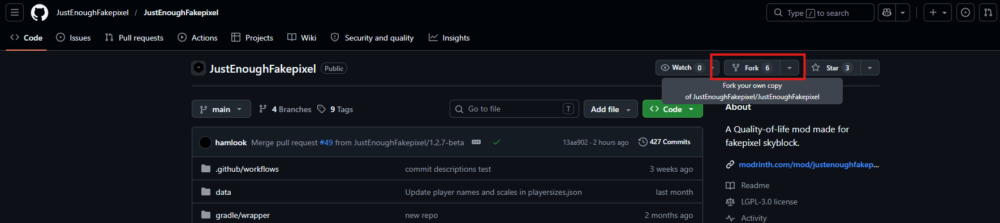
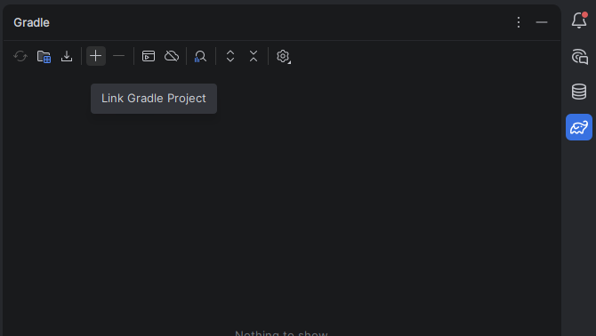
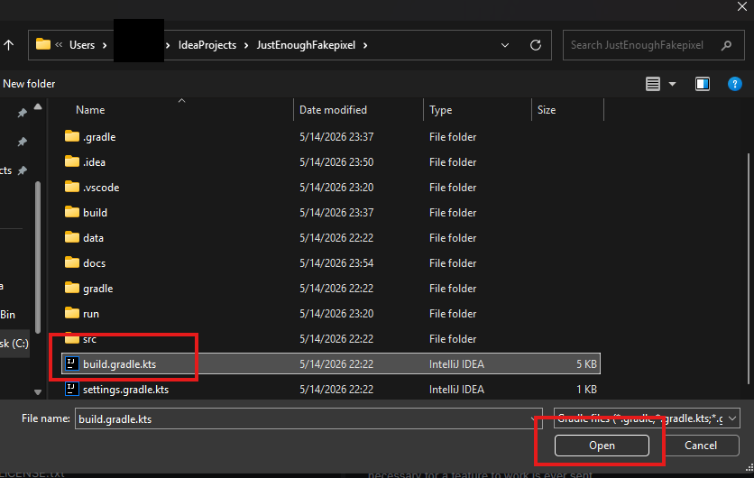
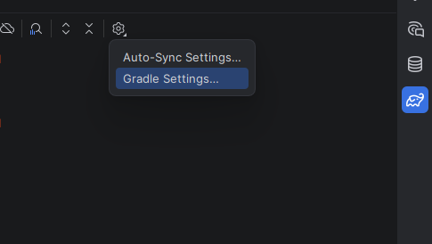
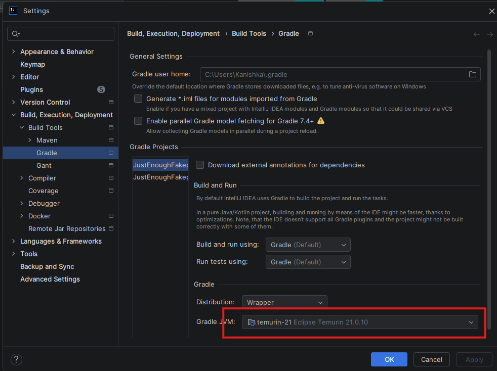
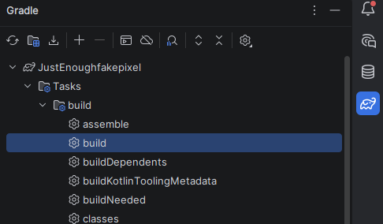

# How to Contribute to Aetheria's skyblock mod

This guide helps Kotlin and Java developers understand how Aetheria (ASM) works, and gives new contributors the steps to get started.

---

## Requirements

Before you begin, make sure you have the following installed:

- **Git** — [git-scm.com](https://git-scm.com/downloads)
- **JDK 21** — [Adoptium Temurin 21](https://adoptium.net/) (recommended)
- **IntelliJ IDEA Community** — [jetbrains.com/idea](https://www.jetbrains.com/idea/download/) (scroll down for the free Community edition)

---

## Step 1 — Fork the Repository

1. Go to [https://github.com/aetheria-org/Aetheria](https://github.com/aetheria-org/Aetheria)
2. Click **Fork** in the top-right corner.
3. Leave all settings as default and click **Create fork**.



---

## Step 2 — Authenticate Git with GitHub

When you first clone or push, IntelliJ will prompt you to log in to GitHub. Click **Log in via GitHub** and complete the browser flow — IntelliJ handles everything automatically and you won't need to enter credentials again.

---

## Step 3 — Clone the Project Locally

Once your fork is created and Git is authenticated, clone it to your machine.

**Option A — via IntelliJ (recommended for beginners)**

1. Open IntelliJ IDEA.
2. On the welcome screen, click **Get from VCS** (or go to **File → New → Project from Version Control**).
3. Select **GitHub** from the left panel — IntelliJ will prompt you to log in if you haven't already.
4. Find your fork of JustEnoughFakepixel in the list and click **Clone**.
5. Choose a local folder and click **Clone**.

**Option B — via terminal (do Alt+F12 OR press on the icon in the bottom left)**

```bash
git clone https://github.com/YOUR_USERNAME/Aetheria.git
cd Aetheria
```

Then open the cloned folder in IntelliJ: **File → Open → select the folder → OK**.

---

## Step 4 — Set Up Gradle

When IntelliJ opens the project for the first time, Gradle will begin downloading dependencies automatically (Minecraft 1.8.9, ForgeGradle, Kotlin, etc.). This can take a few minutes on first run.

If Gradle doesn't start automatically:

1. Open the **Gradle** tab (elephant icon on the right sidebar).
2. Click **Link Gradle Project** and select the `build.gradle.kts` file at the project root.




### Set the Gradle JVM to Java 21

1. In the Gradle tab, click the **gear icon** (⚙️).
2. Select **Gradle Settings**.
3. Set **Gradle JVM** to your Java 21 JDK installation.
4. Click **OK**.





## Step 5 — Run Gradle and Launch the Game

1. In the Gradle tab, click the **reload** button (↻) to sync.
2. Wait for Gradle to finish — this may take a minute.
3. Click on Tasks
4. Click on Build
4. Click the build task with the gear icon



This compiles the mod and produces a `.jar` in `build/libs/`. This is the file you'd drop into a Minecraft `mods/` folder to test the changes.

---
## Project Structure

Here's how the ASM source code is laid out so you know where to put things:

```
src/main/
├──java/io/hamlook/aetheria/
│   ├── Aetheria.java              ← Mod entry point
│   ├── core/                    ← Core systems
│   ├── data/                    ← Data holders
│   ├── events/                  ← Custom events (Java side)
│   ├── features/                ← Feature classes (Java side)
│   │   ├── misc/
│   │   ├── fishing/
│   │   ├── capes/
│   │   └── ...
│   ├── mixins/                  ← All Mixin classes go here
│   │   └── accessors/           ← Accessor mixins
│   ├── init/                    ← Initialization logic
│   ├── repo/                    ← Repo/data loading
│   └── utils/                   ← Utility methods
│
└── kotlin/io/hamlook/aetheria/
    ├── events/                  ← Custom events (Kotlin side)
    └── features/                ← New features go here (Kotlin preferred)
        ├── misc/
        ├── farming/
        ├── mining/
        └── dungeons/
```

**Where to put new files:**

| What you're adding | Where it goes                                                          |
|--------------------|------------------------------------------------------------------------|
| New feature        | `src/main/kotlin/.../features/<category>/YourFeature.kt`               |
| New feature (java) | `src/main/java/.../features/<category>/YourFeature.java`               |
| New Mixin          | `src/main/java/.../mixins/MixinClassName.java`                         |
| New event          | `src/main/kotlin/.../events/YourEvent.kt`                              |
| New utility method | `src/main/java/.../utils/` (add to an existing util class if possible) |


---
## Pushing Your Changes and Opening a Pull Request

Before pushing, make sure everything works:

1. Run `./gradlew build` and confirm it completes with **BUILD SUCCESSFUL** — do not open a PR with a broken build.
2. Launch the game using the build in /build/libs/ and test your changes in-game to confirm they work as expected.
3. Check that you haven't broken anything unrelated to your change.

Once you're confident everything works:

4. Open the **Commit** dialog in IntelliJ with `Ctrl+K` (or go to **Git → Commit**).
5. Stage your changed files, write a short descriptive commit message, and click **Commit**.
6. Push to your fork with `Ctrl+Shift+K` (or go to **Git → Push**) and click **Push**.

Then open the Pull Request on GitHub:

7. Go to your fork on GitHub — you'll see a banner saying your branch had recent changes with a **Compare & pull request** button. Click it.
8. Make sure the base repository is `aetheria-org/Aetheria` and the base branch is `main`.
9. Give your PR a clear title with a prefix — `Feature`, `Fix`, `Improvement`, `Refactor`, etc.
10. Fill out the description template fully and click **Create pull request**.

If a maintainer requests changes, make them on the same branch, commit, and push again — the PR updates automatically.

## Useful Terminal Commands

All commands are run from the project root. Use `./gradlew` on Mac/Linux and `gradlew.bat` on Windows (or just `gradlew` in most terminals).

### Build the mod

```bash
./gradlew build
```

Compiles the mod and produces a `.jar` in `build/libs/`. This is the file you'd drop into a Minecraft `mods/` folder to test outside IntelliJ.

### Check for errors without a full build

```bash
./gradlew compileJava compileKotlin
```

Compiles both Java and Kotlin and reports any errors. Faster than `build` when you just want to check your code.

### Run tests

```bash
./gradlew test
```

Runs any unit tests in the project. Output saved to `build/reports/tests/`.

### Clean build output

```bash
./gradlew clean
```

Deletes the `build/` folder. Useful when you're getting strange errors and want a fresh compile.

### Clean and rebuild from scratch

```bash
./gradlew clean build
```
Full wipe and rebuild. Run this if something seems broken and a normal build doesn't fix it.


## Coding Style & Conventions

- New features should be written in **Kotlin** wherever possible. Java is acceptable for Mixin classes.
- Use [Kotlin coding conventions](https://kotlinlang.org/docs/coding-conventions.html).
- Use [Java coding conventions](https://www.oracle.com/java/technologies/javase/codeconventions-introduction.html) for Java files.
- Follow Fakepixel's rules — do not add features that would be considered cheating.
- Do not copy features from other mods without good reason.
- Avoid using deprecated methods — they are marked for eventual removal.
- Do **not** use `e.printStackTrace()`. Use the mod's existing logging system (`DebugLogger`) instead.
- Avoid Kotlin's `!!` operator where possible. Prefer `?:` (Elvis operator) for null safety.
- Use existing utility methods in the `utils` package before writing new ones.
- All Mixin classes → `src/main/io/hamlook/aetheria/mixins/`

---

## Additional Notes

- ASM targets **Minecraft 1.8.9 Forge**. Many modern Fabric/Forge APIs are not available.
- The mod entry point is `Aetheria.java`. Initialization logic is in the `init/` package.
- The `repo/` package handles loading remote data. If you add new remotely-configurable data, wire it through there.
- On server join, Aetheria sends only your Minecraft username and installed mod list to Aetheria's servers for analytics. Some features (like capes) send additional minimal data strictly necessary for that feature to function. See the README for the full privacy note.

---
